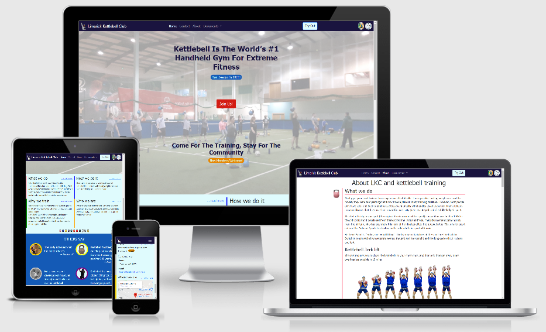
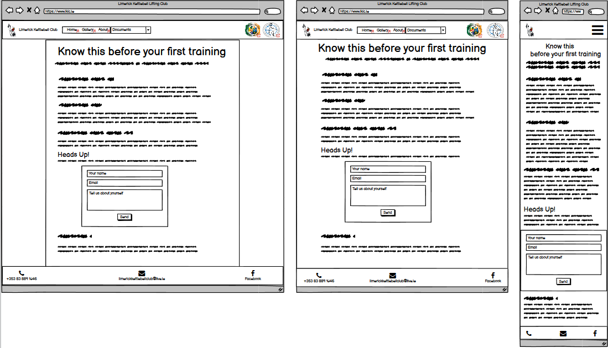
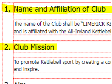
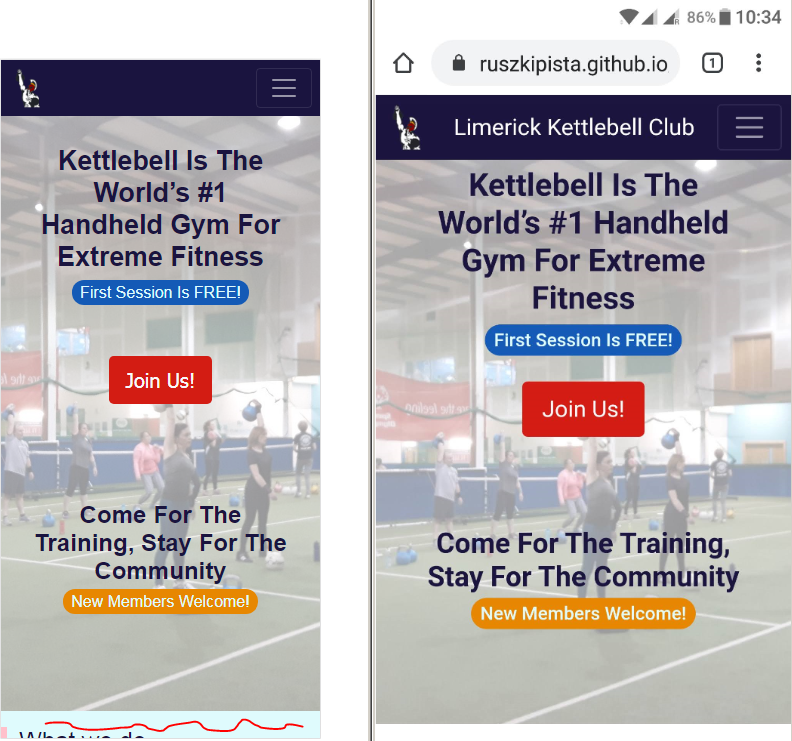

# Limerick Kettlebell Lifting Club

Static website to promote the [Limerick Kettlebell Club](https://www.facebook.com/Limerick-Kettlebell-Club-201978196542853) and [Kettlebell Sport](https://en.wikipedia.org/wiki/Kettlebell_lifting) around Limerick city, Ireland. This project is the first milestone in obtaining a [Full Stack Web Development](https://codeinstitute.net/full-stack-software-development-diploma/) diploma from [Code Institute](https://codeinstitute.net/)



### Attention assessor!
I kept a journal during the development about my daily activities, see it [here](./assets/doc/ci-ms1-study-notes-journal.pdf) frozen in time or [live](https://docs.google.com/document/d/19ohtJUawBUjIifB0DIKjILhsNA2ryk4tIevXz4fkTWM/edit?usp=sharing).

## Contents
- [1. UX design](#1-ux-design "1. UX design")
  - [1.1 Strategy Plane](#11-strategy-plane "1.1 Strategy Plane")
  - [1.2 Scope plane](#12-scope-plane "1.2 Scope plane")
  - [1.3 Structure plane](#13-structure-plane "1.3 Structure plane")
  - [1.4 Skeleton plane](#14-skeleton-plane "1.4 Skeleton plane")
  - [1.5 Surface plane](#15-surface-plane "1.5 Surface plane")
- [2. Features Left to Implement](#2-features-left-to-implement "2. Features Left to Implement")
- [3. Technologies and Tools Used](#3-technologies-and-tools-used "3. Technologies and Tools Used")
- [4. Issues solved during development](#4-issues-solved-during-development "4. Issues solved during development")
  - [4.1 Top-Fixed navbar and anchors](#41-top-fixed-navbar-and-anchors "4.1 Top-Fixed navbar and anchors")
  - [4.2 Trouble with opacity layer on hero image](#42-trouble-with-opacity-layer-on-hero-image "4.2 Trouble with opacity layer on hero image")
  - [4.3 Style list item decorators](#43-style-list-item-decorators "4.3 Style list item decorators")
  - [4.4 Content hinting on mobile device](#44-content-hinting-on-mobile-device "4.4 Content hinting on mobile device")
- [5. Testing](#5-testing "5. Testing")
- [6. Deployment](#6-deployment "6. Deployment")
- [7. Credits](#7-credits "7. Credits")

## 1. UX design
### 1.1 Strategy Plane
Stakeholders of the website:
- visitor - a person visiting the website, not a club member
- member - club member, who actively trains or trained with the club
- officer - affiliated with the club who executes or organises club matters though official capacity
- AIKLF - sport organization which the club is associated with

#### 1.1.1 Goals and Objectives of Stakeholders (users)
|G#|User|Goals, Needs, Objectives|
|--|----|------------------------|
|G1|AIKLF|member organizations feature their affiliation with national (AIKLF) and world organization (IUKL) in info materials|
|G2|officer|provide adequate, easy access training facilities with certified instructors at fair price in popular day/week times|
|G3|officer|increase number of active members by attracting new members and retaining current members|
|G4|officer|organise workshops for the public and other gym trainers|
|G5|officer|promote the club via members’ social networks|
|G6|officer|make available club documents, rules, photos and forms|
|G7|officer|present an attractive image of the club to the public|
|G8|officer|inform about out of ordinary events (e.g. competition results, upcoming events, closure, etc.)|
|G9|officer|send out low cost instant delivery periodicals and notifications to individuals who signed up for it|
|G10|officer|facilitate calendar where members can sign up to events or cancel the same|
|G11|officer|inform about the history of Kettlebell and Kettlebell Sport|
|G12|visitor|find training community which caters for my particulars and interests (gender, age, experience level, dedication to training)|
|G13|visitor|learn about training related questions of what, why, how, who, when, where|
|G14|visitor|learn about venue facilities: reception, change room, locker, parking, price, discount|
|G15|visitor|learn about tools used for training|
|G16|visitor|learn what to expect on the first training|
|G17|officer|make available template training plans|
|G18|member|our heroes: get information about club related competition results|
|G19|officer|increase our authority on the subject in the eyes of the visitors|

### 1.2 Scope plane
It has been decided to create a static website. In light of that decision we do not go forward with
- G5: this goal would be for presence on a social network site, not for a homepage,
- G10: the calendar functionality would require database and programming, therefore out of scope for now,
- G17: at the moment could not obtain these training plans

The following table lists the planned features, each feature referenced with original goal(s):

|F#|Goal|Feature|
|--|----|-------|
|F1|G3|build a custom static website with responsive pages for mobile, tablet and desktop|
|F2||have navigation bar on each pages|
|F3|G1, G19|display LKC’s logo and name, display club’s affiliation with AIKLF and IUKL with logo, name and link, provide description about each|
|F4|G16|provide description about how to prepare, what to bring, what to expect on the first training|
|F5|G7, G12|display attractive photos and texts, member testimonials|
|F6|G13, G19|describe what we do|
|F7|G13|describe why we train|
|F8|G13, G19|describe how: training methods|
|F9|G13, G19|describe who we are, how to contact us|
|F10|G13|inform about training times|
|F11|G13|describe where we train including venue facilities|
|F12|G8|present news articles|
|F13|G8, G9, G18|sign up to newsletter (email)|
|F14|G6, G16|ask Medical Form to be filled|
|F15|G3|allow first time applicant to announce self for training, so coach is notified, can learn more beforehand, this way improving first time experience|
|F16|G3, G6, G14|explain membership|
|F20|G10|display an event/training calendar, allow members to sign up/off|

### 1.3 Structure plane
The structure of the website to be built consist of
- a **Home** page with short leads - all pointing to longer descriptions on the About page,
- a long **About** page receiving traffic from the landing page with many sections with bookmark navigation, end of all sections refer back to **Home** with link
- a **SignUp** page to sign up to receive emails
- a picture **Gallery** page about training, meetups, competitions
- a **News** page related to club events
- a **TryOut** page with every important to know for the first training
- a **Safety** (rules) page to govern the behaviours in the gym
- a **Mission** (statement) page
- a **Constitution** page


### 1.4 Skeleton plane
Feature list in page/section structure with content hinting and navigation links. The following table is a sample, describes the page **TryOut**. Check out the whole list [here](./assets/doc/ci-ms1-features.pdf) in PDF format.

|Page / *section*|Feature#|Feature / Content description|Link or Action|
|--------------|--------|-----------------------------|--------------|
|**TryOut**|F4|come to your first free training||
|*navbar*|F2|*same as on Home*||
||F4|all you need to know for the first occasion: clothes, footwear, water, eating, attention from coach (first line - last line)|https://www.youtube.com/watch?v=cKx8xE8jJZs|
||F4|- coach led, instructed exercises with kettlebell or bodyweight,<br>- everybody is doing the same, but varied to strength level and experience,<br>- length, composition of training,<br>- new joiners get more attention to ramp up their skills,<br>- coach gives out correction instructions to individuals to improve form,<br>- number of attendees are not limited, enabled by the size of the court||
||F14|If you can, download, print, fill, sign Medical Self Assessment|file `MedicalSelfAssessment`|
||F15|Give us a heads up:<br>Form: name /email / telephone / about yourself + Submit button|Send email to coach|

Created wireframes for **TryOut** page in 3 width, see the others as well [here](./assets/doc/ci-ms1-wireframes.pdf) or the balsamiq file [here](./assets/doc/ci-ms1-wireframes.bmpr).


### 1.5 Surface plane
Used the website coolors.co to come up with base colors for styling:

Also decided that for secondary colors will use kettlebell weight color codes. See this image for sample of those colors:

Chose font [Roboto](https://fonts.google.com/specimen/Roboto) for the headers.

## 2. Features Left to Implement
- **Gallery** page - Show images/videos about trainings, competitions and meet-ups
- **SignUp** page - Let visitors sign up with email address for newsletter
- **News** page - collection of news items in date descending order, 2 of the news articles goes on the **Home** page into `news` section
- store news articles in database, automatically fill **News** page with them, enable news article editing to authorized users
- send a selected group of articles in email to subscribers
- create **Calendar** page of actual month, add reference date field to news articles, fill calendar page with news titles which have reference date in given month

## 3. Technologies and Tools Used

- The project's product (the website) was written in HTML and CSS, utilising [Bootstrap 5.0 Beta](https://getbootstrap.com/docs/5.0/) framework (which itself uses CSS and JavaScript). Bootstrap is used for its responsive utilities. There is a petite JavaScript in `index.html` to solve a specific issue.
- The images were manipulated with program [Paint.NET](https://www.getpaint.net/). Mainly used for cropping, resizing, background removal and format conversion.
- Created wireframes with program from [balsamiq](https://balsamiq.com/wireframes/)
- Written study notes and collected textual content on [Google Docs](https://docs.google.com/)
- The code was edited with [Visual Studio Code](https://code.visualstudio.com/), the preview was provided via [Live Server](https://github.com/ritwickdey/vscode-live-server) VS Code extension.
- The code versions were managed with [Git](https://git-scm.com/downloads)
- The code and project deliverables are stored on cloud service [Github](https://github.com/) repository with versions.
- The website is deployed on [GitHub Pages](https://pages.github.com/)
- The development machine runs [Windows 7](https://www.microsoft.com/en-us/software-download/windows7) operating system.
- The website was tested on desktop on [Chrome](https://www.google.com/intl/en_ie/chrome/) and [Firefox](https://www.mozilla.org/en-US/firefox/) web browsers, also on a [OnePlus2](https://www.oneplus.com/ie/support/spec/oneplus-2) mobile phone running [Android](https://www.android.com/) and mobile [Chrome](https://play.google.com/store/apps/details?id=com.android.chrome&hl=en) browser.
- Generated favicons with [Favicon & App Icon Generator](https://www.favicon-generator.org/)
- Generated one image (on top of this Readme) of how the website looks on different size devices with [Am I Responsive](http://ami.responsivedesign.is/)
- Played with colors on [coolors](https://coolors.co/), chose the base colors with it
- Chose font using [Google Fonts](https://fonts.google.com/)
- run CSS code through [Autoprefixer CSS online](https://autoprefixer.github.io/) to supplement suggested vendor prefixes
- Searched the internet to find content, documentation and solution for issues using [Google](www.google.com)'s search service.
- connected to the internet using [Vodafone](https://n.vodafone.ie/shop/broadband.html)'s broadband service.

## 4. Issues solved during development
### 4.1 Top-Fixed navbar and anchors
At late stage added the top-fixed navbar to all pages. Before it was only on **Home**. After the change realised, that when jumping from Home to About to a specific section, e.g. `who`, the title of that section is not visible, because the target section get scrolled to the top of the page and the navbar obscures the top of the section.
Found solution [here](https://stackoverflow.com/questions/19532678/anchored-bookmarks-conflicting-with-fixed-top-of-page-nav).

For each section created its own achor tag, e.g. for `who`:
```HTML
<a class="nav-anchor-negative" id="who"></a>
```
and the class definition in `style.css`:
```CSS
.nav-anchor-negative {
    position:relative; 
    top: -4rem;    
}
```
The solution creates a relative positioned anchor tag above its normal place, so the jump target becomes above the real target, so the target section gets positioned right below the navbar.
### 4.2 Trouble with opacity layer on hero image
**Home** page / Hero image / Call To Action button did not work, although I implemented the same way as we did in the "Whiskey Drop" project. After some debugging I concluded that the opacity layer is in the way, which prevents the clicking. When I commented out this layer, the button worked.
Tried to play with CSS z-index, but was not satisfied with the lot of changes it required just to set up the necessary order of objects, only to make it work.

Found solution [here](https://www.digitalocean.com/community/tutorials/how-to-change-a-css-background-images-opacity) / Method 2. In essence, I threw out the `<div>&nbsp;<div>` from HTML and put the opacity layer functionality into `.hero:before` in `style.css`, where `.hero` holds the content displayed above the hero image.

code in `index.html`:
```HTML
<!-- HEADER - HERO section -->
  <header class="hero ...">
  ...
</header>
```
code in `style.css`:
```CSS
.hero {
    position: relative;
    ...
}
.hero:before {
    content: ' ';
    width: 100%;
    height: 100%;
    position: absolute;
    top: 0;
    left: 0;
    background: url(...) center center / cover no-repeat;
    background-color: ...;
    opacity: 0.4;
    z-index: -1;
}
```
### 4.3 Style list item decorators
When created  `constitution.html` page, where I have a long document with numbered sections, I wanted to style each list item's first paragraph as a heading (e.g.```<h2>```. When I did that, the number in front of the paragraph was not styled the same way. See **expected** result here:



I could not find simple solution on the internet, so I solved this way:
```HTML
<ol class="... list-with-header">
   <li>
      <p>Name and Affiliation of Club</p>
      <p>The name of the Club shall be ...</p>
   </li>
   <li>
      <p>Club Mission</p>
      <p>To promote Kettlebell sport by creating a ...</p>
   </li>
  ...
</ol>
```
and styling in `style.css`:
```CSS
/* style the numbers of the <li>s of <ol> */
.list-with-header > li {
    font-size: 1.5rem;    
}
/* then dial back for the child elements (except for the first one) */
.list-with-header > li > *:not(:first-child) {
    font-size: 1rem;
}
```
Solution: I figured, that to style the numbers, I need to style the whole `<ol>` and then restore the normal style (`font-height`) for every child element, except the first one.

### 4.4 Content hinting on mobile device
Issue: I wanted content hinting on the landing page, by revealing at the bottom of the screen, that the page continues further below the hero image. To achive that, I used `height: 89vh` on the container of the hero image. To my surprise, the `89vh` was not enough on mobile devices, although it looked ok during preview on simulated mobile device screen sizes. Se expected on the left, reality on the right.


The problem is that the browser on a mobile device determines the VH unit in a different way from the browser on a desktop. See issue and solution [here](https://css-tricks.com/the-trick-to-viewport-units-on-mobile/)

Applied solution: created variable `--vh89` on **Home** page to determine the `89%` of "real" `VH` (Vieport Height) for mobile device browsers:
```HTML
<script>
  function setRealVieportHeightVariable(){
    let vh89 = window.innerHeight * 0.89;
    document.documentElement.style.setProperty('--vh89', `${vh89}px`);
  };
  setRealVieportHeightVariable();
  window.addEventListener('resize', setRealVieportHeightVariable);
</script>
```
The event listener is there for capturing the orientation change between portrait and landscape. 

And used the variable `--vh89` in the `style.css`:
```CSS
.hero {
    height: 89vh;
    height: var(--vh89);
    min-height: 27rem;
    ...
}
```

## 5. Testing

First step in testing was the validation of HTML and CSS code with [Markup Validation Service](https://validator.w3.org/) and [CSS Validation Service](https://jigsaw.w3.org/css-validator/) respectively. I did the validations a couple of times during development and once at the end. Now all 6 html pages validate to "Document checking completed. No errors or warnings to show.". The `style.css` file validates to "Congratulations! No Error Found."

The whole testing were condusted manually.

Here is a sample from the test log, see the complete document [here](./assets/doc/ci-ms1-testing.pdf)

```
Scenario: visitor is interested in joining a training session
And may provides a valid email address OR may not
And provides a personal message
Given visitor is on the TryOut page
When scrolls to the HeadsUp section to the form with 3 fields and Send button
And enters something into “Your name” field
And enters a valid email address into “Your email” field OR leaves it empty
And enters something into “Tell us about yourself” field
And clicks on the Send button
Then the form is sent
And new page opens in a separate browser tab with a table of two columns of sent data: (“Input Name”, “Value”)
And there is a table row with values (applicantname, <entered value of “Your name” field>)
And there is a table row with values (applicantemail, <entered value of “Your email” field> OR empty)
And there is a table row with values (applicantstory, <entered value of “Tell us about yourself” field>)
```
|Test no.|Pre-condition|Event|Expected|Result|Comment|
|-|-|-|-|-|-|
|151|TryOut page is open|- Scroll to the section "Heads Up!"<br>- Enter "Visitor" into form field “Your name”,<br>- Enter "visitor@gmail.com" into field "Your email"<br>- Enter "hello" into field “Tell us about yourself”<br>- Click on button "Send"|new page opens in a separate browser tab with a table of<br>(Input Name, Value)<br>(applicantname, Visitor)<br>(applicantemail, visitor@gmail.com)<br>(applicantstory, hello)|pass|-|

The website performs on desktop and mobile devices as intended, no responsivity issues were found.

No additional bugs were discovered during the final testing.

## 6. Deployment

The website is deployed to GitHub Pages automatically by GitHub. The assigned web address is [ruszkipista.github.io/cims01-lkc/](https://ruszkipista.github.io/cims01-lkc/).
Once you host your project files on GitHub and you setup the deployment to GitHub Pages via <repository>/settings/GitHub Pages, then GitHub will copy your files to a webserver every occasion you submit a commit or modify a file. You do not need to do anything to actualize the content of your website.

If you want to deploy this project to a different hosting solution, you need to copy all the files from this repository into the home folder of the webserver, keeping the folder structure as is.

## 7. Credits

### Acknowledgements
My inspiration for this project came from the experience of lack of information when I was looking for a kettlebell group in Limerick to train with.

### Content
The text built into the pages came from the following sources:
- Club coach Nancy Flexman - especially the Mission Statement and Club Constitution, club history, training composition
- various kettlebell specific websites, see the exact source in the code
  - www.aiklf.com
  - www.giri-iukl.com/en/
  - www.kettlebellkings.com
  - www.dragondoor.com
  - breakingmuscle.co.uk
- fitness self assessment form is from https://www.sampleforms.com/fitness-assessment-form.html
- the TryOut page is my own writing (except the "Training session", that is from Nancy)

### Media
See the source of images in the code comments. Here is the short list sources:
- hero picture is from the club's facebook site
- logos are from their respective organization's website
- kettlebell images are mainly from www.kettlebellkings.com
- movement phases images from www.kettlebellsport.eu
- google map widget of Delta is from their website www.deltasportsdome.com/